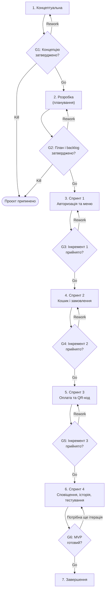

# Життєвий цикл проєкту: CampusBite

## 1. Обрана модель життєвого циклу

- **Конкретна модель:** Scrum.
- **Тип моделі за сучасною класифікацією:** адаптивна (Agile).

**Обґрунтування вибору.** За результатами Лабораторної роботи №2 CampusBite є малим внутрішнім веб-застосунком із середнім рівнем невизначеності вимог, тому частина вимог (часові слоти видачі, робота персоналу з панеллю, інтеграція з оплатою) уточнюватиметься під час розробки. Scrum дозволяє розбити виконання на короткі спринти, кожен з яких завершується працездатним інкрементом продукту, і коригувати план після кожного огляду результатів з користувачами. Короткі цикли також допомагають контролювати головне обмеження проєкту — обмежений час одного виконавця (8–10 годин на тиждень), адже обсяг кожного спринту планується з урахуванням реальної швидкості роботи. Оскільки проєкт виконує одна особа, Scrum застосовується в спрощеному вигляді: ролі Product Owner і розробника суміщені, а щоденні зустрічі замінено коротким самоаналізом наприкінці кожного робочого дня: що зроблено, що заплановано далі та які виникли перешкоди.

## 2. Фази життєвого циклу

Фаза виконання представлена як послідовність чотирьох спринтів тривалістю 2 тижні кожен. Загальна тривалість проєкту — 14 тижнів.

| № | Назва фази | Мета фази | Тривалість (тижнів) | Ключові роботи | Deliverables (проміжні результати) | Відповідальний |
|---|------------|-----------|---------------------|----------------|------------------------------------|----------------|
| 1 | Концептуальна (ініціація) | Сформулювати проблему, цілі та концепцію продукту, оцінити оточення проєкту. | 2 | Вибір теми та назви; опис проблеми й цільової аудиторії; класифікація проєкту; аналіз внутрішнього та зовнішнього оточення; визначення обмежень і припущень. | [project-brief.md](project-brief.md), [project-classification.md](project-classification.md), публічний GitHub-репозиторій | Олійник Андрій (Project Manager, Analyst) |
| 2 | Розробка (планування) | Спланувати роботи, визначити обсяг MVP та підготувати технічну основу. | 2 | Вибір моделі життєвого циклу; опитування студентів і персоналу їдальні; формування Product Backlog та пріоритезація функцій; прототип інтерфейсу у Figma; вибір технологій і платіжного провайдера. | [project-lifecycle.md](project-lifecycle.md), Product Backlog і Kanban-дошка в GitHub Projects, прототип інтерфейсу у Figma, план спринтів | Олійник Андрій (Product Owner, Designer) |
| 3 | Виконання: Спринт 1 | Створити основу застосунку та перегляд меню. | 2 | Налаштування проєкту та хостингу; авторизація за університетською поштою; сторінка меню з фото, ціною, складом і наявністю; панель персоналу для редагування меню. | Інкремент 1: розгорнутий застосунок з авторизацією та меню, панель керування меню | Олійник Андрій (Developer) |
| 4 | Виконання: Спринт 2 | Реалізувати оформлення замовлення. | 2 | Кошик; вибір часового слоту отримання; створення замовлення; список вхідних замовлень у панелі персоналу. | Інкремент 2: можливість оформити замовлення на конкретний час | Олійник Андрій (Developer) |
| 5 | Виконання: Спринт 3 | Реалізувати оплату та видачу за QR-кодом. | 2 | Інтеграція з платіжним провайдером у тестовому (sandbox) режимі; генерація QR-коду після оплати; сканування QR-коду та підтвердження видачі в панелі персоналу. | Інкремент 3: повний сценарій «замовлення → оплата → отримання за QR-кодом» | Олійник Андрій (Developer) |
| 6 | Виконання: Спринт 4 | Доповнити продукт до повного MVP і перевірити його з користувачами. | 2 | Статуси замовлення та push-сповіщення; історія замовлень і улюблені страви; налаштування PWA; тестування з кількома студентами та персоналом їдальні. | Інкремент 4: MVP з 7 ключовими функціями, звіт про тестування з користувачами | Олійник Андрій (Developer, Designer) |
| 7 | Завершення | Перевірити, здати продукт і підбити підсумки проєкту. | 2 | Виправлення виявлених помилок; фінальне тестування; оформлення документації та інструкції користувача; презентація продукту; ретроспектива проєкту. | Фінальна версія застосунку, документація в репозиторії, презентація, звіт-ретроспектива | Олійник Андрій (Project Manager) |

## 3. Ворота між фазами

| Ворота | Між фазами | Критерії переходу | Можливі рішення |
|--------|------------|-------------------|-----------------|
| G1 | Фаза 1 → Фаза 2 | Проблему, цільову аудиторію та основну функціональність описано в project-brief.md; проєкт класифіковано, оточення проаналізовано; тему погоджено з викладачем. | Go / Rework / Kill |
| G2 | Фаза 2 → Фаза 3 | Сформовано та пріоритезовано Product Backlog; визначено обсяг MVP; прототип інтерфейсу готовий; обрано технології та платіжного провайдера з тестовим режимом; складено план спринтів. | Go / Rework / Kill |
| G3 | Фаза 3 → Фаза 4 | Застосунок розгорнуто на хостингу; авторизація працює; меню відображається на смартфоні та редагується в панелі персоналу; проведено Sprint Review і ретроспективу. | Go / Rework / Kill |
| G4 | Фаза 4 → Фаза 5 | Користувач може додати страви в кошик, обрати часовий слот і створити замовлення; замовлення з'являється в панелі персоналу; критичних помилок немає. | Go / Rework / Kill |
| G5 | Фаза 5 → Фаза 6 | Тестова оплата проходить успішно; після оплати формується QR-код; персонал може відсканувати код і підтвердити видачу замовлення. | Go / Rework / Kill |
| G6 | Фаза 6 → Фаза 7 | Усі 7 ключових функцій MVP реалізовано; тестування з користувачами проведено, критичні зауваження усунено; застосунок коректно працює в мобільних браузерах. | Go / Rework / Kill |

**Значення рішень:** Go — перехід до наступної фази; Rework — доопрацювання поточної фази (для спринтів — додаткова ітерація з незавершеними задачами); Kill — припинення проєкту, якщо його подальше виконання неможливе або недоцільне.

## 4. Візуалізація життєвого циклу

## 5. Обґрунтування вибору моделі

На вибір моделі найбільше вплинули три характеристики проєкту, визначені в Лабораторній роботі №2: середній рівень невизначеності вимог, малий розмір проєкту та обмежений часовий ресурс одного виконавця. Базові сценарії продукту зрозумілі, але багато деталей можна уточнити лише після того, як студенти та персонал їдальні спробують робочу версію. Тому потрібна модель, яка дозволяє швидко отримувати працездатні частини продукту й змінювати план за результатами зворотного зв'язку, — саме такою є Scrum.

Як альтернативи розглядалися каскадна (Waterfall), V-подібна, інкрементна та спіральна моделі. Каскадна та V-подібна моделі відхилені, оскільки вимагають повністю зафіксованих вимог на початку проєкту, а будь-які зміни на пізніх етапах коштують дуже дорого. Інкрементна модель близька до обраної, але передбачає заздалегідь визначений склад інкрементів і менше можливостей для зміни пріоритетів між ними. Спіральна модель з обов'язковим аналізом ризиків на кожному витку є надто трудомісткою для малого навчального проєкту з одним виконавцем. Kanban також розглядався, але без фіксованих спринтів складніше контролювати терміни, прив'язані до графіка семестру, тому він використовується лише як інструмент візуалізації задач усередині Scrum.

Для цього проєкту Scrum має такі переваги: кожні два тижні з'являється працездатний інкремент, який можна показати користувачам і викладачу; найважливіші функції (меню, замовлення, оплата, QR-код) реалізуються першими, тому навіть за нестачі часу буде готовий корисний продукт; ворота після кожного спринту дають змогу вчасно виявити відставання та переглянути обсяг робіт. Крім того, ретроспективи після спринтів допомагають поступово покращувати оцінку власної швидкості роботи.

Водночас модель має потенційні ризики. По-перше, у Scrum обсяг робіт може постійно розширюватися через нові побажання користувачів; щоб цього уникнути, обсяг MVP фіксується на воротах G2, а нові ідеї додаються в Product Backlog на наступні версії. По-друге, при суміщенні всіх ролей в одній особі бракує незалежного погляду на результат, тому на Sprint Review планується залучати кількох студентів і персонал їдальні. По-третє, інтеграція з оплатою може зайняти більше часу, ніж заплановано; цей ризик мінімізується використанням тестового режиму платіжного провайдера та резервним тижнем у фазі завершення.
